 
## 查看主页获取源码

> **作者介绍**： **✌**全网粉丝10W+本平台特邀作者、博客专家、CSDN新星计划导师、java领域优质创作者,博客之星、掘金/华为云/阿里云/InfoQ等平台优质作者、专注于项目实战 **✌**

  

### 一、作品包含

源码+数据库+设计文档万字+PPT+全套环境和工具资源+部署教程

### 二、项目技术

前端技术：Html、Css、Js、Vue、Element-ui

数据库：MySQL

后端技术：Java、Spring Boot、MyBatis

  

### 三、运行环境

开发工具：IDEA/eclipse + 微信开发者工具

数据库：MySQL5.7

数据库管理工具：Navicat10以上版本

环境配置软件： JDK1.8+Maven3.6.3

前端Nodejs：14

### 四、项目介绍
项目编号：mpweixinA045

酒店管理APP及微信小程序以现代酒店业服务升级和数字化转型为背景，致力于为酒店提供一套全面的在线管理解决方案。通过集成房态管理、订单处理、客户服务、营销推广等功能，该应用旨在提升酒店运营效率，优化顾客入住体验，同时拓宽酒店的市场覆盖，推动酒店业的智能化发展。

前台分为用户和员工
用户功能：首页、房间信息、菜单信息、留言板、我的。
员工功能：首页、房间信息、菜单信息、留言板、我的。

后台管理员的功能：个人中心、顾客管理、员工管理、房间类型管理、房间信息管理、菜品分类管理、菜单信息管理、商品分类管理、商品信息管理、订房信息管理、入住登记管理、订餐信息管理、商品购买管理、卫生服务管理、卫生打扫管理、留言板管理以及系统管理。

### 五、运行截图

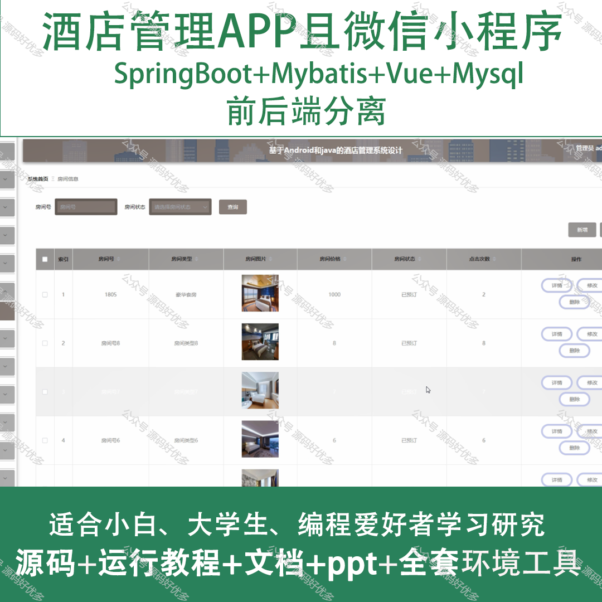
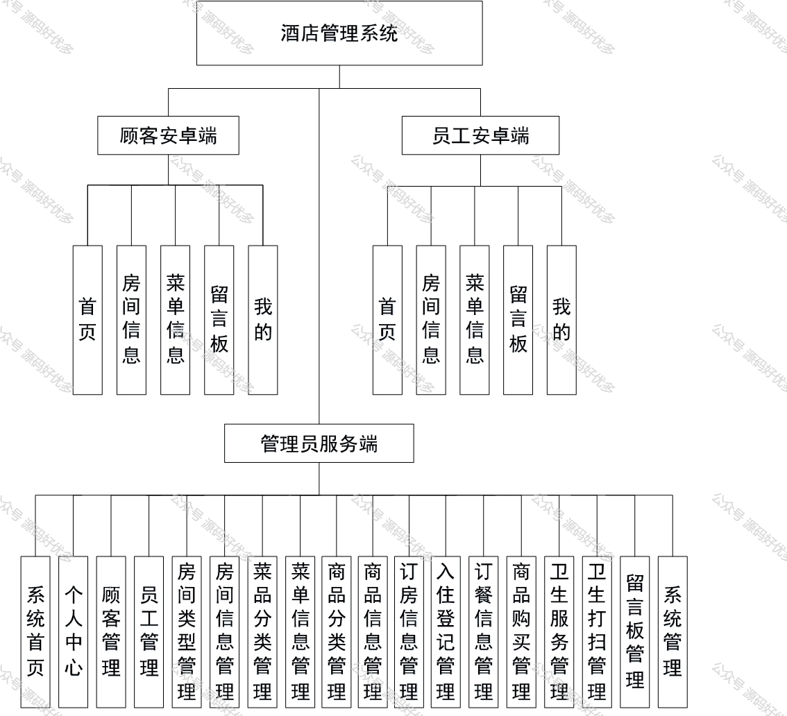
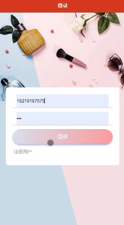
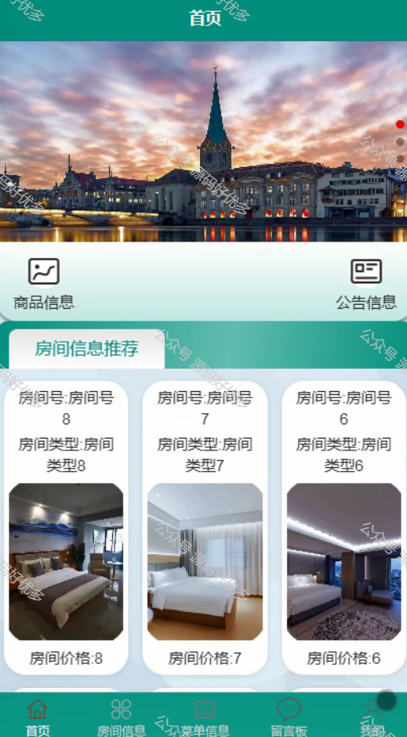
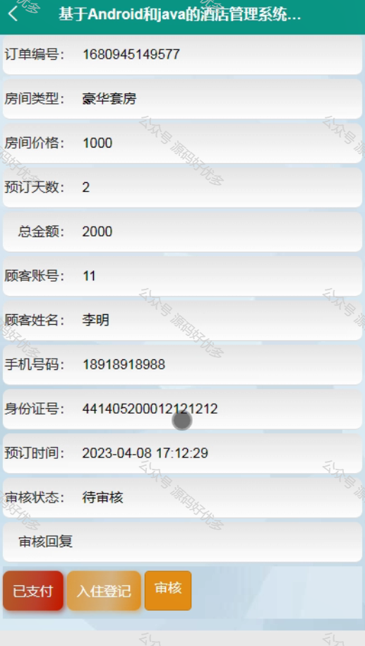
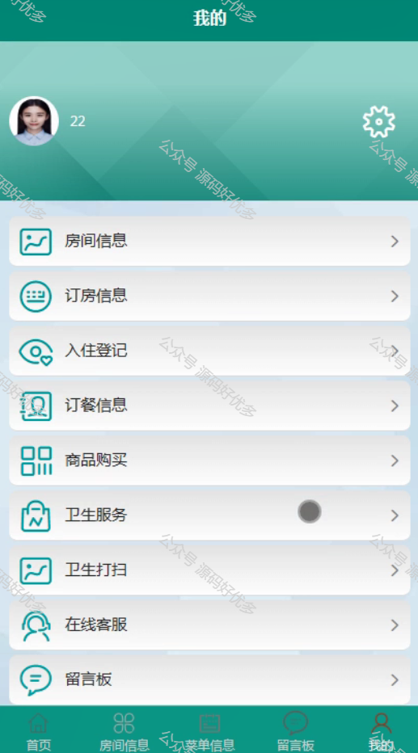
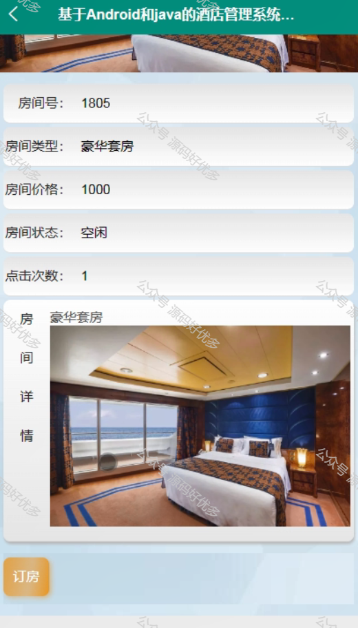
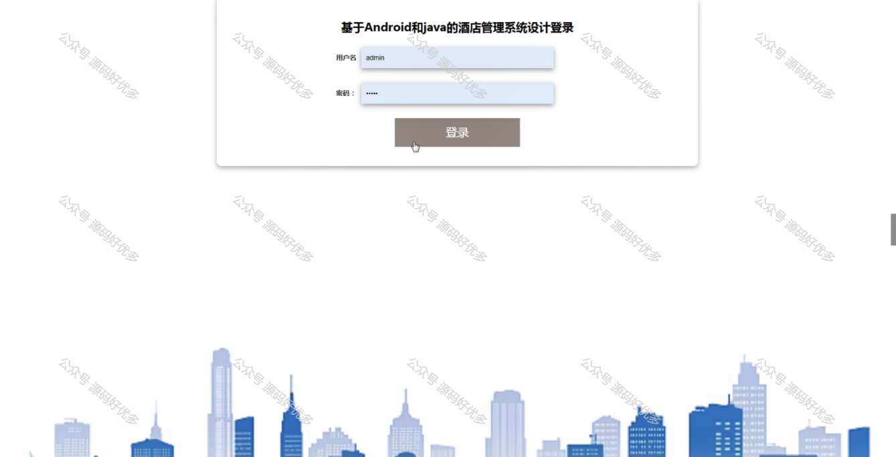
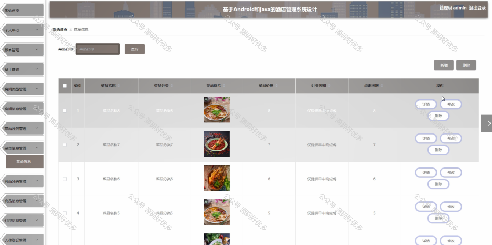
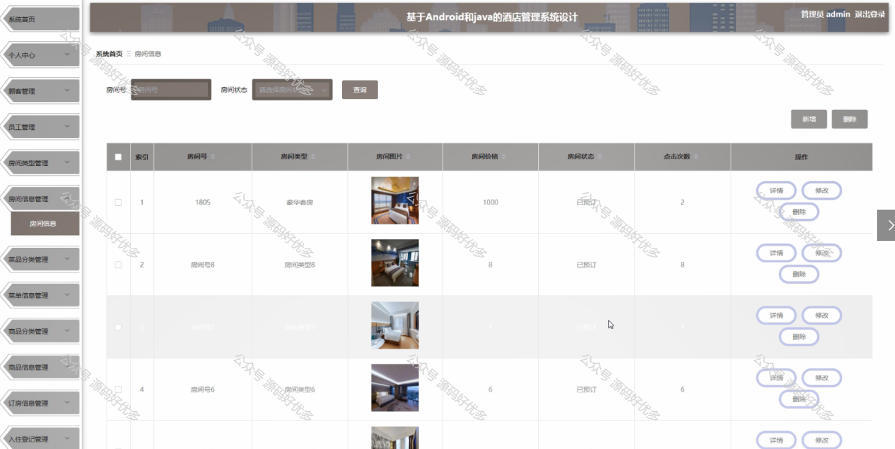
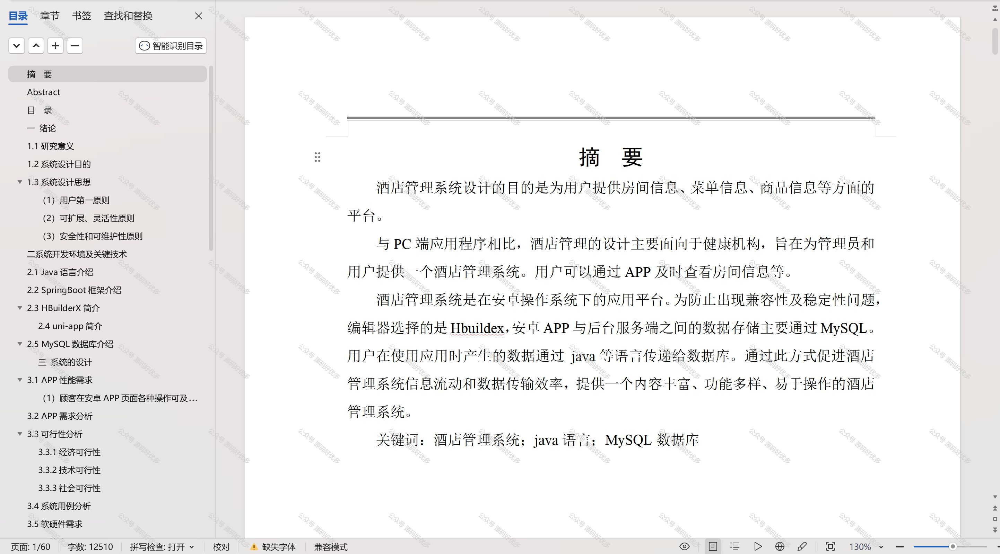

  
